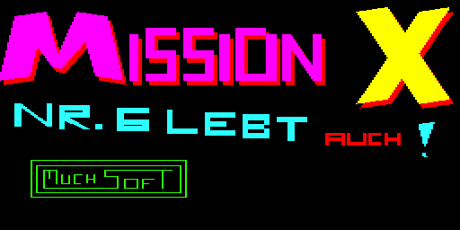
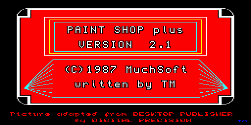
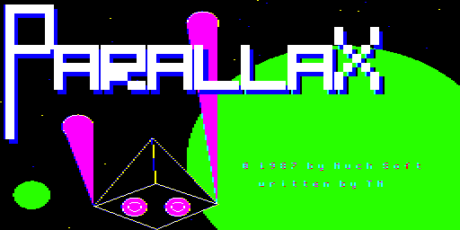

# SuperBASIC applications for the Sinclair QL

In 1986 and 1987 I wrote some applications for the [Sinclair QL](https://en.wikipedia.org/wiki/Sinclair_QL)
(it was my second home computer; after my ZX Spectrum and before my Atari ST).

The QL already had a pre-emptive multitasking operating system
called [QDOS](https://en.wikipedia.org/wiki/Sinclair_QDOS).
As the processor was a Motorola 68008, it was rather easy to
write 68k assembler routines for the QL (which I did at the end of my
"QL years"), but for the most part I coded in [SuperBASIC](https://en.wikipedia.org/wiki/SuperBASIC).

These are my QL applications (at least the ones that I remember):

| Application | Year | Description |
| ----------- | ---- | ----------- |
| CopyShop                | 1986 | file manager for copying files; published in ["68000er" magazine](https://twitter.com/thmuch/status/1181201318830104576) (July 1987) |
| Tut Anch Amun           | 1986 | game: [text adventure](https://en.wikipedia.org/wiki/Adventure_game#Text_adventures_and_interactive_fiction) |
| [Diamonds](Diamonds/)   | 1987 | game (Boulder Dash clone) |
| [GAM](GAM/)             | 1987 | Graphic Application Manager; SuperBASIC extension and system GUI |
| [MissionX](MissionX/)   | 1987 | game: dismantle bombs with a robot |
| [PaintShop](PaintShop/) | 1987 | painting images (raster graphics)  |
| [Parallax](Parallax/)   | 1987 | game: trade in space |
| Q-Ball                  | 1987 | game (Breakout / Arkanoid clone); unfortunately I lost the source code... |

The software requires a German MG-QDOS (["MGG"](http://www.dilwyn.me.uk/qlrom/)),
as I used undocumented features (`MISTake` etc.) and umlauts in procedure
name (remember, it was at least a year before Unicode!).

You'll find old archives of my software [here](https://snailshell.de/QL/).
And if you want to learn more about SuperBASIC and the QL: Someone
digitized the [QL users manual](http://www.dilwyn.me.uk/docs/ebooks/olqlug/) 😃

## Bootloader images

Some of the applications featured fancy bootloader images – with 8 colours
and 256x256 pixels (stretched to 512x256 pixels):

